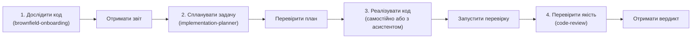

# 🧭 Посібник: Покрокова робота зі скілами в Antigravity

Цей посібник призначений для **самостійного, поетапного освоєння розробки за допомогою AI-агентів**. 

Головний принцип роботи — **повний контроль людини на кожному етапі**:
> **Запуск одного скіла** ➡️ **Отримання структурованого звіту** ➡️ **Аналіз результатів людиною** ➡️ **Рішення про наступний крок**.

---

## 🚀 Крок 0: Інтеграція бандла в глобальну інфраструктуру Antigravity

Щоб набір скілів та базові правила агента стали доступними у **всіх ваших проєктах** на комп'ютері без необхідності копіювати їх у кожну нову папку, додайте їх у глобальну конфігурацію:

### 1. Куди встановити скіли (`skills/`):
Скопіюйте папки скілів із каталогу `skills/` у глобальну директорію Antigravity:

* **Windows:**
  ```text
  %USERPROFILE%\.gemini\config\skills\
  ```
  *(наприклад: `C:\Users\<Ваше_Ім'я>\.gemini\config\skills\`)*
* **macOS / Linux:**
  ```bash
  ~/.gemini/config/skills/
  ```

### 2. Куди покласти контракт правил (`AGENTS.md`):
* **Глобально (рекомендовано):** покладіть `AGENTS.md` у:
  * Windows: `%USERPROFILE%\.gemini\config\AGENTS.md`
  * macOS / Linux: `~/.gemini/config/AGENTS.md`
  
  *Це забезпечить роботу базових правил безпеки (заборона ламати файли, заборона несанкціонованих комітів/пушів) у будь-якій папці, де ви відкриваєте Antigravity.*
* **Локально в проєкті (опціонально):** якщо конкретний проєкт потребує власних унікальних правил, технологічного стеку чи команд перевірки — покладіть `AGENTS.md` безпосередньо у корінь цього проєкту (він матиме вищий пріоритет над глобальним).

### 3. Перевірка підключення:
Відкрийте Antigravity і напишіть агенту в чаті:
> *"Які скіли тобі зараз доступні?"*

Агент підтвердить наявність скілів. Завдяки механізму **Progressive Disclosure** скіли не перевантажують контекстну пам'ять — повний текст інструкції підвантажується лише в момент виклику відповідного скіла.

---

## 📋 Стандарт обов'язкового звіту агента (Report Gate)

Після кожного запуску скіла агент зобов'язаний надати фінальний структурований звіт:
1. **Що було виконано:** короткий підсумок проведеної роботи та аналізу.
2. **Зміни у файлах:** перелік створених або змінених файлів (якщо скіл передбачав внесення правок).
3. **Результати перевірки (Checks):** статус збірки, тестів, лінтерів або перевірки типів (`PASS` / `FAIL`).
4. **Виявлені ризики або відкриті питання:** крайові випадки, архітектурні нюанси чи моменти, які потребують рішення людини.
5. **Рекомендований наступний крок:** який наступний крок або скіл є логічним продовженням (за вашим бажанням).

---

## 🧰 Каталог скілів: покроковий запуск

Обирайте потрібний скіл під поточну задачу, копіюйте текст промпту та запускайте його в чаті.

---

### 1. 🏗️ Скіл: `agentic-harness` — Ініціалізація нового проєкту з нуля
* **Коли запускати:** коли ви створили порожній репозиторій і хочете швидко налаштувати інфраструктуру якості під обраний стек (Next.js, Astro, React, Node.js, Python тощо).
* **Готовий промпт:**
  > *"Використай скіл `agentic-harness` для налаштування нового проєкту на [вказати стек]. Допоможи згенерувати команди перевірки (`verify`), правила якості та базовий `AGENTS.md`. Надай підсумковий звіт про налаштування."*
* **Що ви отримаєте у звіті:** конфігураційні файли, налаштовану команду повної перевірки (наприклад, `npm run verify`), підтвердження готовності проєкту до безпечної розробки.
* **Наступний крок (за бажанням):** перевірте запуск команди `verify` у терміналі та переходьте до планування першої фічі (`implementation-planner`).

---

### 2. 🔍 Скіл: `brownfield-onboarding` — Дослідження існуючого / чужого коду
* **Коли запускати:** коли ви відкрили готовий або старий проєкт і хочете швидко розібратися в архітектурі без ризику щось зламати.
* **Готовий промпт:**
  > *"Досліди цей проєкт за допомогою скіла `brownfield-onboarding`. Визнач точки входу, стек технологій, стан тестів і оціни зону ризику (Blast Radius) для можливих змін. Не внось змін у код, надай детальний аналітичний звіт."*
* **Що ви отримаєте у звіті:** огляд структури репозиторію, перелік критичних модулів, спосіб запуску й тестування, рекомендації з безпечного внесення змін.
* **Наступний крок (за бажанням):** спланувати рефакторинг або нову задачу через `implementation-planner`.

---

### 3. 📝 Скіл: `implementation-planner` — Планування фічі перед кодингом
* **Коли запускати:** коли є ідея чи завдання, але ви хочете спершу зафіксувати чіткі межі, архітектуру та вимірні критерії успіху.
* **Готовий промпт:**
  > *"Сплануй реалізацію [опис фічі або задачі] за допомогою скіла `implementation-planner`. Сформулюй вимірні Acceptance Criteria, перелік файлів для модифікації та перевірки якості. Код не пиши, сформуй план у вигляді артефакту `implementation_plan.md`."*
* **Що ви отримаєте у звіті:** документ `implementation_plan.md` з чітким описом архітектурних рішень і кнопкою схвалення.
* **Наступний крок (за бажанням):** переглянути план, внести побажання і лише після власного схвалення перейти до написання коду.

---

### 4. ⚡ Скіл: `dag-runner` — Багатомодульні завдання з паралельними воркерами
* **Коли запускати:** коли задача складається з кількох незалежних модулів, і потрібно виконати їх паралельно без конфліктів у спільних файлах.
* **Готовий промпт:**
  > *"Виконай задачу за допомогою скіла `dag-runner`. Розподіли підзадачі за хвилями (Waves) згідно з матрицею володіння файлами. Використовуй модель `flash` для модулів та `pro` для архітектурних контрактів. Після кожної хвилі надай звіт про стан перевірок."*
* **Що ви отримаєте у звіті:** статус проходження кожної хвилі, список змінених модулів, результати детермінованих перевірок якості.
* **Наступний крок (за бажанням):** запустити фінальний аудит результату через `code-review`.

---

### 5. 🕵️ Скіл: `code-review` — Red-Team аудит та перевірка коду
* **Коли запускати:** після завершення написання коду — для пошуку прихованих помилок, регресій, вразливостей або невідповідності типам.
* **Готовий промпт:**
  > *"Проведи поглиблене Red-Team рев'ю останніх змін за допомогою скіла `code-review`. Перевір крайові випадки, безпеку, суворість типів і відсутність зайвого коду. Надай звіт із таблицею зауважень (High / Medium / Low) та вердиктом PASS або FAIL."*
* **Що ви отримаєте у звіті:** точний список зауважень із номерами рядків у файлах, аналіз ризиків і підсумковий вердикт якості.
* **Наступний крок (за бажанням):** виправити знайдені зауваження або виконати загальний аудит техборгу.

---

### 6. 🏛️ Скіл: `tech-debt-auditor` — Аудит технічного боргу (2026)
* **Коли запускати:** для перевірки зрілості всієї кодової бази: архітектурних вузьких місць, швидкодії, доступності (a11y) та безпеки.
* **Готовий промпт:**
  > *"Проведи комплексний аудит кодової бази на наявність технічного боргу за допомогою скіла `tech-debt-auditor`. Перевір модульність, типізацію, потенційні витоки пам'яті, доступність та продуктивність. Надай звіт з пріоритизованими рекомендаціями."*
* **Що ви отримаєте у звіті:** оцінку надійності, масштабованості та відповідності сучасним інженерним стандартам із конкретними точками покращення.
* **Наступний крок (за бажанням):** обрати одне з покращень і поставити задачу через `implementation-planner`.

---

### 7. 🐞 Скіл: `bug-diagnosis` — Пошук першопричини дефектів (Root Cause)
* **Коли запускати:** коли щось падає або поводиться некоректно, і ви хочете зрозуміти точну причину перед тим, як хаотично міняти код.
* **Готовий промпт:**
  > *"Діагностуй проблему [описати баг або вставити текст помилки] за допомогою скіла `bug-diagnosis`. Знайди першопричину на основі коду та логів. Код самостійно не змінюй, надай аналітичний звіт із варіантами виправлення."*
* **Що ви отримаєте у звіті:** точне місце виникнення дефекту, механізм його виникнення та порівняльний аналіз 2–3 способів усунення.
* **Наступний крок (за бажанням):** обрати безпечний варіант виправлення і реалізувати його.

---

### 8. 🌐 Скіл: `modern-web-guidance` — Сучасні веб-стандарти та Web API
* **Коли запускати:** під час роботи над версткою, інтерактивними формами, діалогами, складними анімаціями або браузерними API, щоб уникати застарілих бібліотек.
* **Готовий промпт:**
  > *"Знайди найкращі практики та сучасні Web API для реалізації [наприклад: валідації форми, діалогового вікна, View Transitions] за допомогою скіла `modern-web-guidance`. Поясни рекомендований стандарт і надай мінімальний робочий приклад."*
* **Що ви отримаєте у звіті:** рекомендації на базі актуальних веб-стандартів, приклади семантичного HTML/CSS/JS.
* **Наступний крок (за бажанням):** використати запропонований патерн у своєму проєкті.

---

## 🗺️ Рекомендований навчальний маршрут знайомства

Для комфортного першого знайомства з можливостями скілів рекомендується пройти простий ланцюжок:



> [!TIP]
> **Золоте правило автономної розробки:** переходьте до наступного кроку лише після того, як ви уважно переглянули звіт агента на поточному етапі!
