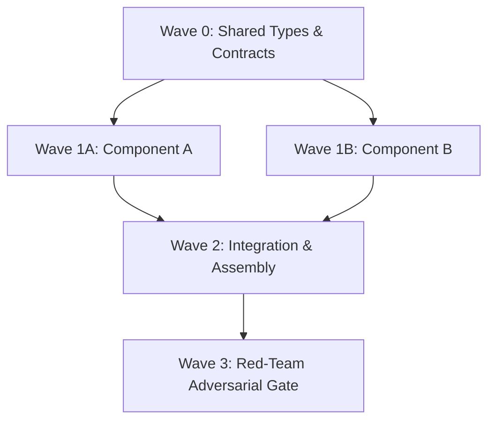

# DAG Task Specification Template

## 1. Meta & Task Goals
- **Task Name:** <Назва задачі>
- **Objective:** <Вимірна бізнес/технічна мета>
- **Max Total Token Budget:** <наприклад: 150_000 токенів>
- **Deterministic Quality Command:** `<наприклад: pnpm verify / npm test>`

---

## 2. DAG Decomposition & Waves

---

## 3. File Ownership Matrix (Anti-Conflict)

| Wave | Subagent Role | Model | Workspace | Exclusive Write Scope (Files) | Token Limit |
| :--- | :--- | :--- | :--- | :--- | :--- |
| **Wave 0** | Contract Architect | `pro` | `inherit` | `src/types/*.ts`, `src/contracts/*.ts` | 20k |
| **Wave 1A** | Worker Module A | `flash` | `branch` | `src/modules/moduleA/**`, `tests/moduleA/**` | 35k |
| **Wave 1B** | Worker Module B | `flash` | `branch` | `src/modules/moduleB/**`, `tests/moduleB/**` | 35k |
| **Wave 2** | Integrator | `inherit` | `inherit` | `src/index.ts`, `src/app/**` | 30k |
| **Wave 3** | Red-Team Verifier | `pro` | `inherit` | READ-ONLY (`reports/red-team-eval.md`) | 30k |

---

## 4. Quality Gates & Sync Points

1. **Gate 0 (Contracts):** `pnpm typecheck` must PASS 100%.
2. **Gate 1 (Parallel Modules):** `pnpm test` across each branched workspace.
3. **Gate 2 (Integration):** `pnpm verify` (lint + build + test + e2e).
4. **Gate 3 (Red-Team):** 0 Critical/High issues, Adversarial verdict = `PASS`.

---

## 5. Circuit Breaker Policy
- **Max Retries per Gate:** 2 iterations.
- **Trigger for Escalation:** Failing tests after 2 automatic self-healing attempts -> Pause & notify Human Operator with logs and reproduction script.

---

## 6. Multi-Agent DAG & Orchestrator Rules (Mandatory)

### ⚠️ Handoff Rule (ПРАВИЛО БЕЗШОВНОГО ПЕРЕХОДУ)
Якщо затверджений план (`implementation_plan.md`) містить паралельні хвилі (Multi-Agent DAG / Parallel Waves 1..N):
1. Головний агент (Root Orchestrator) **СУВОРО НЕ МАЄ ПРАВА** власноруч створювати або модифікувати файли модулів (`write_to_file` / `replace_file_content`) під час виконання паралельних хвиль.
2. Головний агент **ЗОБОВ'ЯЗАНИЙ** діяти виключно через інструмент `invoke_subagent`, призначаючи субагентам ізольовані завдання згідно з матрицею володіння файлами (*File Ownership Matrix*).
3. Головний агент відповідає виключно за:
   - Підготовку базових контрактів (Wave 0);
   - Запуск та контроль точок синхронізації (Sync Points / Quality Gates через `run_command`);
   - Інтеграцію та фінальний Red-Team аудит (Wave 3).
